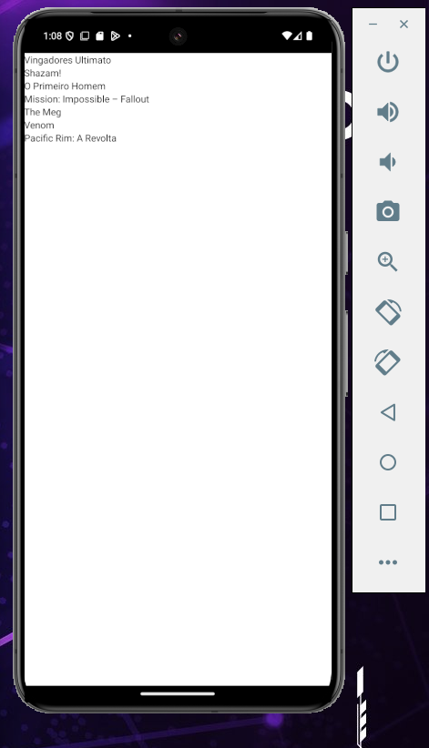

# Preview de commits

* Adicionando axios no projeto
`yarn add axios`

* Recuperando filmes da api, fazendo uma iteração e listando os nomes com flatlist:

* Criando componentes filmes e detalhes, fazendo a listagem do filmes e carregando os dados
